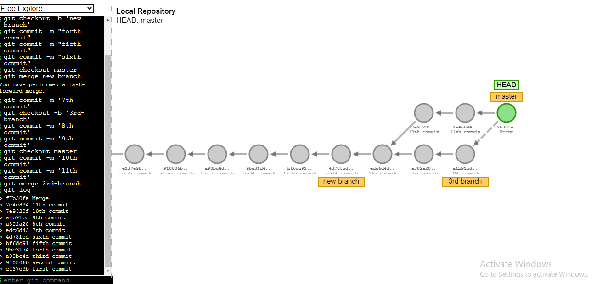

# BIAM-Bagura 
### Foundation training for DTE's Officials (Teachers')

### [Lesson 3. How to set git environment and configuration]([https://youtu.be/vj5-nkhTRbo](https://www.youtube.com/watch?v=rDzGu785qBY&list=PLxqLmn_MNa-Sl7EtwOFCV4zWEwleEd3mk))

- Download and install git on your pc: https://git-scm.com/
- check git version: open terminal or cmd then use the command `git --version` to find out whether git is installed or not. if git is installed it will return a version number of git.

 
